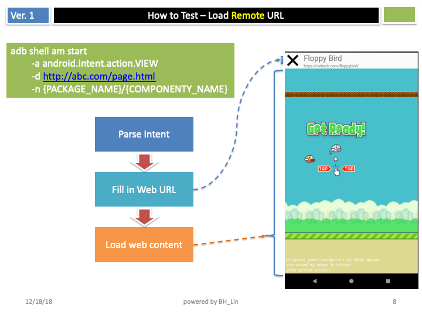

# SimpleWebViewForAndroid2

A feature-rich Android WebView browser application that provides a simple yet powerful web browsing experience with advanced JavaScript integration capabilities.




#### Here is the demo to launch webview with URL by using intent.


## Features

### Core Features
- **WebView Browser**: Full-featured web browsing with URL input and navigation
- **Intent Integration**: Launch URLs via Android intents from other applications
- **JavaScript Interface**: Custom Android-JavaScript bridge for app interactions
- **File Browser**: Open and load local files through system file picker
- **JavaScript Injection**: Runtime JavaScript code injection for web page manipulation
- **Multi-Activity Architecture**: Different WebView configurations for various use cases

### Technical Features
- **WebView Debugging**: Chrome DevTools integration for debugging (API level 19+)
- **Cookie Management**: Full cookie support for web sessions
- **Permissions**: Camera, microphone, and audio recording permissions for media-rich web apps
- **Custom User Agent**: Android app proxy interface accessible from JavaScript
- **Responsive Design**: Handles orientation changes and screen configurations
- **Background Navigation**: Browser-style back/forward navigation

## Project Structure

```
app/src/main/java/com/bh/android/browser/
├── MainActivity.java           # Main browser activity with full UI
├── WebViewActivity.java        # Simple WebView activity for intent handling
├── WebViewHostActivity.java    # Full-screen WebView host
├── WebViewFragment.java        # Reusable WebView fragment
├── InputTextFragment.java      # JavaScript injection input dialog
└── AppJavaScriptProxy.java     # JavaScript-Android bridge interface
```

## Activities Overview

### MainActivity
The primary browser interface featuring:
- URL input field with keyboard shortcuts
- Progress bar for page loading indication
- Menu options for JavaScript injection and file opening
- Full WebView configuration with debugging enabled
- Cookie management and JavaScript interface

### WebViewActivity
Simplified WebView activity designed for:
- Handling `ACTION_VIEW` intents from other apps
- Display-only web content with basic navigation
- Title and URL display in text views
- Minimal UI for focused content viewing

### WebViewHostActivity
Full-screen WebView experience with:
- Fragment-based architecture
- Immersive mode with hidden action bar
- Intent parameter processing
- Navigation bar hiding for distraction-free browsing

## JavaScript Bridge (AppJavaScriptProxy)

The app provides a custom JavaScript interface accessible via `androidAppProxy`:

```javascript
// Get device serial number
var deviceId = androidAppProxy.getDeviceId();

// Navigate back
androidAppProxy.back();

// Get access key (base64 encoded)
var accessKey = androidAppProxy.getAccessKey();

// Hide action bar (when in WebViewHostActivity)
androidAppProxy.hideActionBar();
```

## Permissions

The app requires the following permissions:
- `INTERNET` - Web browsing functionality
- `ACCESS_NETWORK_STATE` - Network connectivity checks
- `MICROPHONE` - WebRTC audio features
- `RECORD_AUDIO` - Audio recording in web apps
- `MODIFY_AUDIO_SETTINGS` - Audio configuration
- `CAMERA` - WebRTC video features
- `WRITE_EXTERNAL_STORAGE` - File downloads and storage

## Build Configuration

- **Target SDK**: 28 (Android 9.0)
- **Minimum SDK**: 14 (Android 4.0)
- **Build Tools**: 28.0.3
- **Support Library**: 28.0.0

## Key Features Implementation

### WebView Configuration
```java
// Enable JavaScript and debugging
mWebView.getSettings().setJavaScriptEnabled(true);
WebView.setWebContentsDebuggingEnabled(true);

// Media playback without user gesture
mWebView.getSettings().setMediaPlaybackRequiresUserGesture(false);

// JavaScript interface
mWebView.addJavascriptInterface(new AppJavaScriptProxy(this, mWebView), "androidAppProxy");
```

### Intent Handling
The app responds to `ACTION_VIEW` intents, allowing other apps to open URLs:
```xml
<intent-filter>
    <action android:name="android.intent.action.VIEW" />
</intent-filter>
```

### JavaScript Injection
Users can inject custom JavaScript code at runtime through the injection fragment, enabling:
- DOM manipulation
- Custom functionality addition
- Debugging and testing
- Web page enhancement

## Installation

1. Clone the repository
2. Open in Android Studio
3. Build and run on device or emulator

## Usage

### Basic Browsing
1. Launch the app
2. Enter URL in the address bar
3. Press Enter or Go to navigate

### Intent-based URL Opening
Other apps can open URLs in this browser by sending `ACTION_VIEW` intents.

### JavaScript Injection
1. Click the injection icon in the toolbar
2. Enter JavaScript code in the dialog
3. Click "Inject" to execute the code on the current page

### File Opening
1. Click the file icon in the toolbar
2. Select a file from the system file picker
3. The file will be loaded in the WebView

## Development Notes

- The app uses Android Support Library for backward compatibility
- WebView debugging is enabled for development builds
- All activities handle orientation changes gracefully
- The app supports both HTTP and HTTPS with cleartext traffic allowed
- Custom error handling and progress indication throughout the app
